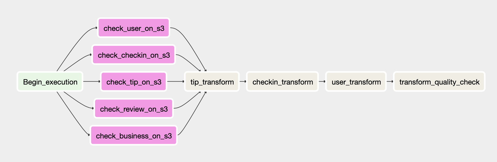
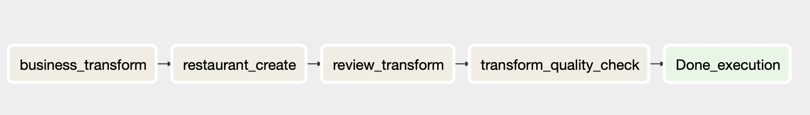

# Data Engineering Capstone Project

## Project Summary

This project involves data about businesses listed on yelp, and perform ETL such that the data can be further analysed. The dataset includes thousands of businesses and reviews and ratings related to them. It also includes data about the users and specifically where each user is checking in and all the places reviewed and rated by that user.

Using the available data sources listed above, we will build an ETL pipeline that extracts their data from S3, processes them using Spark, and loads the data back into S3. The data lake, which will be hosted on S3 can be then used to query to find out what are the popular businesses according to each category, which could be useful for both users and owners etc. We also have a lot of text data, which can be later used to create a sentiment analysis report. There are long reviews as well as short tips, both which can say a lot about a business.

### 1. Scope the Project and Gather Data

The data is taken from the yelp dataset challenge and can be downloaded from [here](https://www.kaggle.com/yelp-dataset/yelp-dataset). In the dataset you'll find information about businesses across 11 metropolitan areas in four countries.

Since the rubric mentions more than one data sources/types, we will later convert some data to csv. Only those files that are necessary will be converted to csv.

The data collected was as follows. The business data looks like the following.

* *Business Data* - This dataset contains business data including location data, attributes, and categories.
```
  {
    // string, 22 character unique string business id
    "business_id": "tnhfDv5Il8EaGSXZGiuQGg",

    // string, the business's name
    "name": "Garaje",

    // string, the full address of the business
    "address": "475 3rd St",

    // string, the city
    "city": "San Francisco",

    // string, 2 character state code, if applicable
    "state": "CA",

    // string, the postal code
    "postal code": "94107",

    // float, latitude
    "latitude": 37.7817529521,

    // float, longitude
    "longitude": -122.39612197,

    // float, star rating, rounded to half-stars
    "stars": 4.5,

    // integer, number of reviews
    "review_count": 1198,

    // integer, 0 or 1 for closed or open, respectively
    "is_open": 1,

    // object, business attributes to values. note: some attribute values might be objects
    "attributes": {
        "RestaurantsTakeOut": true,
        "BusinessParking": {
            "garage": false,
            "street": true,
            "validated": false,
            "lot": false,
            "valet": false
        },
    },

    // an array of strings of business categories
    "categories": [
        "Mexican",
        "Burgers",
        "Gastropubs"
    ],

    // an object of key day to value hours, hours are using a 24hr clock
    "hours": {
        "Monday": "10:00-21:00",
        "Tuesday": "10:00-21:00",
        "Friday": "10:00-21:00",
        "Wednesday": "10:00-21:00",
        "Thursday": "10:00-21:00",
        "Sunday": "11:00-18:00",
        "Saturday": "10:00-21:00"
    }
 }
```

* *Review Data* - This dataset contains full review text data including the user_id that wrote the review and the business_id the review is written for.

* *Checkin Data* - This dataset includes Checkins on a business.

* *Tip Data* - Tips written by a user on a business. Tips are shorter than reviews and tend to convey quick suggestions.

* *User data* - This dataset contains User data including the user's friend mapping and all the metadata associated with the user.

The aim of the project will be to develop a data pipeline, such that the provided data can be transformed, cleaned, and loaded back into a S3 in parquet format. We will execute Airflow DAGs to generate the data warehouse parquet files on S3.

The main information and questions a user may want to extract form the data would be;

* Top 10 Restaurants in a particular city
* Highest Rated business
* Most visited Store in a neighborhood
* Most Active users on the platform
* Which stores are open after 10pm
* Average Sentiment scores for each businesses

### 2. Platform choices and Justification

This project idea was inspired from my last 2 projects which were data lakes and data pipelines. I decided to come up with a solution that combined both those concepts.

**Amazon S3 and Spark to build the Data Lake**

We get the ease of schema design and can rely on schema-on-read. The availability is to a wide range of users with access to S3 bucket. Another influencing factor in the choice of Amazon S3 as the final storage platform for the data was the low cost of this solution compared to a Redshift implementation at this stage.

**Parquet format files**

 There are several reasons to use parquet format. Firstly the data is compressed, which reduces costs. Reading from parquet files is really quick. Columnar storage improves the efficiency of data reads when filtering by column values. The data can be partitioned, that can help analysts access certain subsets of data faster.

 **Apache Airflow**

 The reason I chose to use airflow, was to be able to create the data pipeline easily. On top of this, airflow offers strong observability over the pipeline. It is valuable to be able to create managed dependencies between tasks, schedule them as required over the months of the data set and then see a visualisation of success or failure.

### 3. Define the Data Model

The following data model was chosen;

**BUSINESS** and **RESTAURANTS**

Unwanted columns were dropped. Using explode and split functions in spark the lists of information in the data have been made more accessible.

The restaurants have all categories filtered to Restaurants. One can even change the filters to create a table for any business as desired. You can even change the join file in the review.py file to get specific reviews tables.

| Table Name :: `business` and `business_rest`      
| - `address string `  full postal address   
| - `b_id string` unique primary key id of each entity  
| - `categories string` list of categories  
| - `city string`  located city    
| - `hours string` operating hours and timings   
| - `is_open string` business is open or not    
| - `latitude string` latitudes   
| - `longitude string` longitudes  
| - `name string` name of business    
| - `postal_code string` area code     
| - `review_count string` reviews made     
| - `star string` stars given    
| - `state string` located state  
| - `category_1 string` expanded catgories list  
| - `category_2 string`  expanded catgories list   
| - `category_3 string`  expanded catgories list

**USER**

| Table Name :: `user`                   
|-- `average_stars double` stars given                           
|-- `compliment_cool long` count of cool compliments               
|-- `compliment_cute long` count of cute compliments                 
|-- `compliment_funny long` count of funny compliments                
|-- `compliment_hot long`  count of hot compliments              
|-- `cool long` cool users    
|-- `elite string` years of elite status     
|-- `fans long` how many fans     
|-- `friends string`  how many friends   
|-- `funny long` funny users   
|-- `name string`  Name of person reviewing   
|-- `review_count long` no.of review      
|-- `useful long` useful comments    
|--` user_id string`  user id unique            
|-- `yelping_since string`  when they joined  

**REVIEW**

Business and user columns were joined to get the keys/ids for other tables. Thus making this out fact table.

| Table Name :: `review`       
|-- `business_id string` business identifier       
|-- `cool long` was it cool      
|-- `date string` date review written      
|-- `funny long` was it funny      
|-- `review_id string` review identifier      
|-- `stars double` stars given out of 5      
|-- `text string` the whole review transcript      
|-- `useful long` useful count      
|--` user_id string`  user id unique         
|--` name string`  name of the business that is reviewed      

**TIP**

A unique id column was created. The tip column gives short text information about a particular business. It may come in handy when comparing it with reviews.

| Table Name :: `tip`  
|-- `business_id string` business identifier      
|-- `tip_id string` tip unique identifier      
|-- `date string` date tip was written      

**CHECKIN**
The date column was split and transformed to many other columns that will help analyst extract crucial insights on user activity on a particular day of the week or a month.

| Table Name :: `checkin`        
|-- `business_id string` business identifier      
|-- `date: string ` list of checkin date full timestamps      
|-- `date_only date` checkin date      
|-- `day: string` checkin day name      
|-- `day_number string` checkin day number      
|-- `checkin_count integer` count of total checkins that day      


## 4. Running the ETL

#### Set up the environment

Please follow standard setup for the tools used - Airflow, Spark, Anaconda from official documentation. I have setup everything according to the guidelines in the Udacity lectures. **_Please make sure that everything runs on the same environment_**. I would suggest run all processes on local computer and not on an VM or docker containers. Possible issues can be that the separate java versions are running on the spark shells etc.

Please make sure that you have a properly running Airflow instance.

### ETL Steps

The following outlines the steps.

#### 1. Convert Files

The files are downloadable from the Kaggle website [https://www.kaggle.com/yelp-dataset/yelp-dataset]
According to the dataset's description on Kaggle

- 5,200,000 user reviews
- Information on 174,000 businesses
- The data spans 11 metropolitan areas  

The data files available for download are as listed below:

- yelp_academic_dataset_business.json
- yelp_academic_dataset_checkin.json
- yelp_academic_dataset_review.json
- yelp_academic_dataset_tip.json
- yelp_academic_dataset_user.json

Run the Jupyter notebook - _convert_upload.ipynb_. In this notebook, I have added an option to select 1 million rows from certain files just in case the user has shortage of memory. We can also skip that task.

Since there was requirement of 2 data sources, Business and Checkin have been converted to csv.

Ensure that all the newly transformed files are in the same destination folder.

#### 2. Upload to S3

In the same Jupyter notebook - _convert_upload.ipynb_ , we will upload the data to S3 bucket named _psp-capstone_.

1. Create IAM user S3 and insert the aws credentials first.
2. Create boto3 client first and the create the bucket.
3. Run the tasks to upload the files to the bucket. Since file sizes are large, a timeout of the session can occur. In such case please upload that single file instead. Since I wanted to give options to upload the files, a jupyter notebook was required.

The data will be stored on S3 inside the following path in the bucket - _'s3n://psp-capstone/psp-capstone/raw/filegoeshere'_

#### 3. ETL

Before we start running the ETL process, we need to ensure that we have added all the directory paths and aws credentials to the necessary places. Since we are performing Schema on read, each transformation will require starting a Spark Session and connection to Native S3.

* The bash_command in the BashOperators need to have correct path of the transformation files (stored in transform folder).
* AWS credentials need to be put in all files so that they can be read from S3. You will need to add the credentials in the hadoop configuration for accessing the S3 native file system. You can either put them manually or create a config file. I chose to add manually. These following links show how to do it in other ways - [1](https://medium.com/@mrpowers/working-with-s3-and-spark-locally-1374bb0a354) , [2](https://medium.com/@bogdan.cojocar/how-to-read-json-files-from-s3-using-pyspark-and-the-jupyter-notebook-275dcb27e124). In case you get an access denied error please have a look at [this](https://aws.amazon.com/premiumsupport/knowledge-center/s3-troubleshoot-403/). This is no indication that the DAGs not run properly or the project has issues. Please make sure that when a Spark Session is created, you have all the spark jars and hadoop aws packages.

I have chosen to configure the spark session and the aws connections as per the lectures in data lakes and data pipelines. You can feel to set the configurations according to your own comfort. Restart the DAGs if in case some error occurs.

##### 1) Airflow configuration
In the running instance of Airflow, we will need to create an S3 connection.

On Airflow UI, go to Admin > Connections
Create a new connection with the following attributes:
* Conn Id: my_conn_S3
* Conn Type: S3
* Extra: `{"aws_access_key_id":"_your_aws_access_key_id_", "aws_secret_access_key": "_your_aws_secret_access_key_"}`
* Leave all the other fields (Host, Schema, Login) blank.

##### 2) Data Quality Checks

The following ensures that the data has been inserted correctly.

A custom S3DataExistsOperator operator has been created to ensure all files are present in the S3 bucket. Its the first step to the ETL pipeline.

There are 2 quality checks that ensure that the files are correctly transformed to parquet or not. First one is run in the first DAG and the other one is run in the second DAG.

##### 3) Airflow DAGs

Ensure all the necessary libraries are installed.
The Dags are illustrated below. This DAG needs to run first. It is named dag_lake. AS seen in the diagram we first check for the S3 files.

Then we proceed to the transformation of the tip, checkin and user data respectively. AS shown in the above data model, transformations are made and the new files are uploaded to _lake_ folder in the S3 bucket.

Lastly a data quality check is performed to ensure all files have been transformed and uploaded correctly in parquet format.



This image below is of the second DAG. It is named _trans_parquet_.

We transform the business, create new table restaurant, transform review tables respectively. AS shown in the above data model, transformations are made and the new files are uploaded to the same _lake_ folder in the S3 bucket.

Lastly the second data quality check is performed to ensure all files have been transformed and uploaded correctly in parquet format.



### Scenario Handling

#### Data Increased by 100x

* If the data increased, I would use an EMR setup and increase cluster size to handle bigger data.

* If I were to perform the same schema on read from S3 like this project, during the staging phase I would partition subsets of data and change the Ariflow dags to run certain subsets of data at a time.
#### Pipelines to be run at 7am

* I would add daily intervals with some quality checks and send emails on failures. This will ensure that the scheduler also runs properly and the people who are responsible for this project are notified.

#### Database to be accessed by 100+ people

* I would use an Analytical Columnar database like Redshift where there is excellent performance for read operations. It also has good scaling capabilities.

### Additional steps

Once all the data has been transformed, business intelligence experts can then visualise the data. A good place to connect S3 data with Amazon Athena connector in Tableau can be found [here](https://www.tableau.com/about/blog/2017/5/connect-your-s3-data-amazon-athena-connector-tableau-103-71105).

##### Author - Pranav Prajapati
The my references file has links to all the important references that I made during this project. Hopefully this helps someone with their projects in the future.
